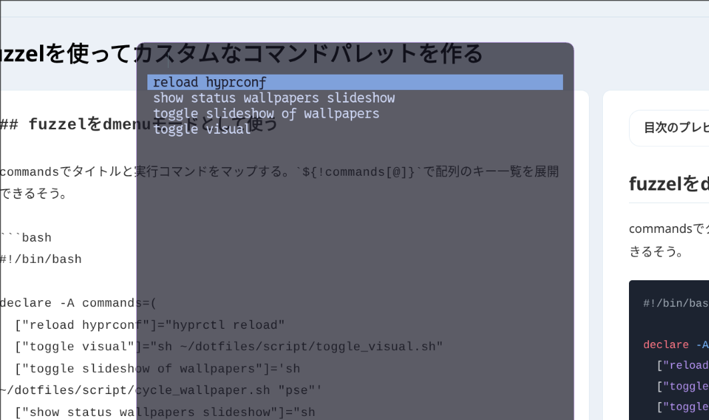

## Overview


This repository contains a fully-featured, customizable desktop environment designed for productivity and visual appeal. It includes configurations for window managers, terminals, shells, text editors, and various utility applications.

## Core Components

### Desktop Environment
*   **Window Manager**: Hyprland (primary) with alternative configs for Hypr-Presto, Hyprshell, and Niri
*   **Status Bar**: Waybar (multi-WM aware)
*   **Application Launcher**: Fuzzel
*   **Notification Daemon**: SwayNC
*   **Screen Lock/Idle Management**: hyprlock / hypridle
*   **Wallpaper Management**: awww daemon with automated cycling
*   **Clipboard Manager**: cliphist (text + images)
*   **File Manager**: Nautilus

### Terminals & Shells
*   **Terminal Emulators**: Ghostty (primary), Kitty
*   **Shell**: Zsh
*   **Shell Plugins**: Managed via Sheldon
*   **Prompt**: Custom Git-aware prompt with status indicators

### Development Tools
*   **Text Editors**: Neovim (primary), Helix, Vim
*   **Version Control**: Git with custom aliases and helpers
*   **Code Formatter**: Stylua (Lua), Biome (JS/TS)
*   **System Monitor**: btop

### Input & Accessibility
*   **Input Method**: Fcitx5 (CJK support)
*   **Key Remapping**: keyd for custom keyboard layouts
*   **Authentication**: hyprpolkitagent, gnome-keyring

## Features

### Advanced Wallpaper Management

The wallpaper system uses `awww` daemon and `cycle_wallpaper.sh` for automated wallpaper rotation with multiple modes:

- **Sequential**: Cycle through wallpapers in order (next/previous)
- **Random**: Jump to a random wallpaper
- **Safe Mode**: Switch to a public-appropriate default wallpaper
- **Slideshow**: Automatic cycling with systemd timer
- **Status Display**: View current slideshow state

### Special Workspaces

In Hyprland, Beyond standard workspaces (1-10), special named workspaces provide quick access to commonly used applications:
- **Msg**: Dedicated workspace for messaging applications
- **ScrPad**: Scratchpad workspace for quick-access utilities

### Command Palette

A custom Python-based command palette (`SUPER + R`) provides quick access to custom commands and scripts via Fuzzel integration.



### Multi-Monitor Support

Configured for dual-monitor setups with proper scaling:
- Laptop display (eDP-1): 1920×1200 @ 1.0x scale
- External display (DP-1): 3840×2160 @ 1.5x scale

## Keybindings

The `SUPER` key (Windows/Command key) is the main modifier.

### Application Launchers
| Keybinding          | Action                                 |
| :------------------ | :------------------------------------- |
| `SUPER + T`         | Launch terminal (Ghostty)              |
| `SUPER + D`         | Launch application launcher (Fuzzel)   |
| `SUPER + E`         | Launch file manager (Nautilus)         |
| `SUPER + R`         | Command palette                        |
| `SUPER + C`         | Toggle notification center (SwayNC)    |

### Window Management
| Keybinding          | Action                                 |
| :------------------ | :------------------------------------- |
| `SUPER + Q`         | Close active window                    |
| `SUPER + F`         | Toggle fullscreen                      |
| `SUPER + V`         | Toggle window float state              |
| `SUPER + J`         | Toggle split direction                 |
| `SUPER + Arrow Keys`| Move focus between windows             |
| `SUPER + SHIFT + Arrow Keys` | Move active window        |
| `SUPER + ALT + Arrow Keys` | Resize active window        |
| `SUPER + Mouse`     | Move/resize windows                    |

### Workspace Navigation
| Keybinding          | Action                                 |
| :------------------ | :------------------------------------- |
| `SUPER + 1-0`       | Switch to workspace 1-10               |
| `SUPER + SHIFT + 1-0` | Move window to workspace 1-10        |
| `SUPER + S`         | Toggle special workspace `Msg`         |
| `SUPER + \`         | Toggle special workspace `ScrPad`      |
| `SUPER + Mouse Scroll` | Cycle through workspaces            |

### Wallpaper Controls
| Keybinding          | Action                                 |
| :------------------ | :------------------------------------- |
| `SUPER + W`         | Next wallpaper (sequential)            |
| `SUPER + SHIFT + W` | Previous wallpaper                     |
| `SUPER + CTRL + ALT + W` | Random wallpaper                  |
| `SUPER + ALT + W`   | Safe/default wallpaper                 |

### Screenshots
| Keybinding          | Action                                 |
| :------------------ | :------------------------------------- |
| `PRINT` or `SUPER+P`| Screenshot active window               |
| `SHIFT + PRINT`     | Screenshot current monitor             |
| `CTRL + SHIFT + S`  | Screenshot region (selection)          |

### System Controls
| Keybinding          | Action                                 |
| :------------------ | :------------------------------------- |
| `SUPER + L`         | Lock screen (hyprlock)                 |
| `SUPER + SHIFT + V` | Open clipboard history (cliphist)      |
| `SUPER + =`         | Zoom in cursor area                    |
| `SUPER + -`         | Zoom out cursor area                   |
| `SUPER + ALT + 0`   | Reset cursor zoom                      |

### Media Controls
| Keybinding          | Action                                 |
| :------------------ | :------------------------------------- |
| `SUPER + K`         | Play/Pause media                       |
| Media Keys          | Volume up/down, brightness controls    |

### Gestures
- **3-finger swipe left/right**: Switch workspaces
- Natural scrolling on mice (disabled on trackpad)

## Scripts

The `script/` directory contains utility scripts for various desktop functions:

| Script | Purpose |
|--------|---------|
| `audio_swicher.sh` | Interactive audio output switcher using wpctl and fuzzel |
| `cmd_pallet.py` | Python-based command palette for quick command access |
| `cycle_wallpaper.sh` | Wallpaper rotation: next, previous, random, or pause slideshow |
| `launch-waybar.sh` | WM-aware waybar launcher (Hyprland/Niri/Sway) |
| `mpris.sh` | MPRIS media player info extraction for status bar |
| `safe_wallpaper.sh` | Switch to public-appropriate default wallpaper |
| `search_apps.sh` | Application and command search utility |
| `status_of_slide.sh` | Display wallpaper slideshow status |
| `tlp-waybar-status.sh` | TLP power management status for waybar |
| `toggle_screen.sh` | Toggle external monitor on/off |
| `toggle_theme.sh` | Switch between light and dark themes |

## Installation (Don't support)

A simple installation method is not yet available. Please install the software and link the settings folder yourself.

## Repository Structure

```
.
├── .config/             # Application configurations
│   ├── hypr/            # Hyprland configuration
│   ├── hypr-presto/     # Hyprland Presto variant
│   ├── niri/            # Niri compositor configuration
│   ├── waybar/          # Status bar configuration
│   ├── ghostty/         # Ghostty terminal config
│   ├── kitty/           # Kitty terminal config
│   ├── fish/            # Fish shell config
│   ├── nvim/            # Neovim configuration
│   ├── helix/           # Helix editor config
│   ├── fuzzel/          # App launcher config
│   ├── swaync/          # Notification daemon config
│   ├── fastfetch/       # System info tool config
│   ├── yazi/            # File manager TUI config
│   └── ...              # Other application configs
├── script/              # Utility scripts
│   ├── cycle_wallpaper.sh
│   ├── toggle_theme.sh
│   ├── toggle_visual.sh
│   ├── cmd_pallet.py
│   └── ...
├── setup/               # Installation scripts
│   ├── setup.sh         # Full setup with package installation
│   └── links.sh         # Configuration linking only
├── etc/                 # System-level configurations
│   └── keyd/           # Key remapping daemon config
├── .zshrc              # Zsh shell configuration
├── .nvmrc              # Node version specification
└── README.md           # This file
```

## Hyprland Configuration

### Monitor Setup

Dual-monitor configuration optimized for laptop + external display:
```
monitor=eDP-1,1920x1200,0x0,1    # Laptop display
monitor=DP-1,3840x2160,0x0,1.5   # External 4K display at 150% scale
```

### Input Configuration

- **Keyboard**: US layout with Caps Lock remapped to Super
- **Mouse**: Natural scrolling enabled
- **Touchpad**: Natural scrolling disabled, tap-to-click enabled
- **Gestures**: 3-finger swipe for workspace switching

### Window Rules

Custom rules for specific applications:
- Pavucontrol: Floating at 800×600
- Custom dev-float windows: 1200×900 centered

## Shell Configuration

### Zsh (.zshrc)

Features:
- **History**: 1 million events with deduplication
- **Git-aware prompt**: Shows branch, status (✔/✘), remote tracking
- **Package managers**: Homebrew (macOS) and Linux-specific tools
- **Environment**: Fcitx5, SSH agent, `.env` file loading
- **Functions**: Git helpers, utility functions, distro detection

Key functions:
- `gc`: Conventional commit helper
- `rezsh`: Reload shell configuration
- `toup`: composite command of mkdir -p and touch

## Key Remapping (keyd)

The `etc/keyd/` directory contains configurations for the keyd daemon:
- `apple.conf`: Key remapping for Apple keyboards

To use, copy to system location:
```bash
sudo cp etc/keyd/apple.conf /etc/keyd/ # or ln -s
sudo systemctl enable --now keyd
```

## Alternative Window Managers

While Hyprland is the primary window manager, configurations are included for:

- **Niri** (`.config/niri/`): Scrollable-tiling Wayland compositor

## Customization

### Changing Wallpapers

Wallpapers are managed by the `awww` daemon. Place images in `~/Pictures/wallpapers/` (or configure a different directory in `script/cycle_wallpaper.sh`).

Use wallpaper keybindings or run scripts directly:
```bash
# Next wallpaper
./script/cycle_wallpaper.sh seq

# Random wallpaper
./script/cycle_wallpaper.sh rnd

# Public wallpaper
./script/safe_wallpaper.sh
```

### Modifying Keybindings

Edit `.config/hypr/hyprland.conf` and search for `bind=` or `bindm=` entries. After making changes, reload Hyprland configuration.

### Adding Startup Applications

Add to the `exec-once` section in `.config/hypr/hyprland.conf`:
```conf
exec-once = your-application
```

