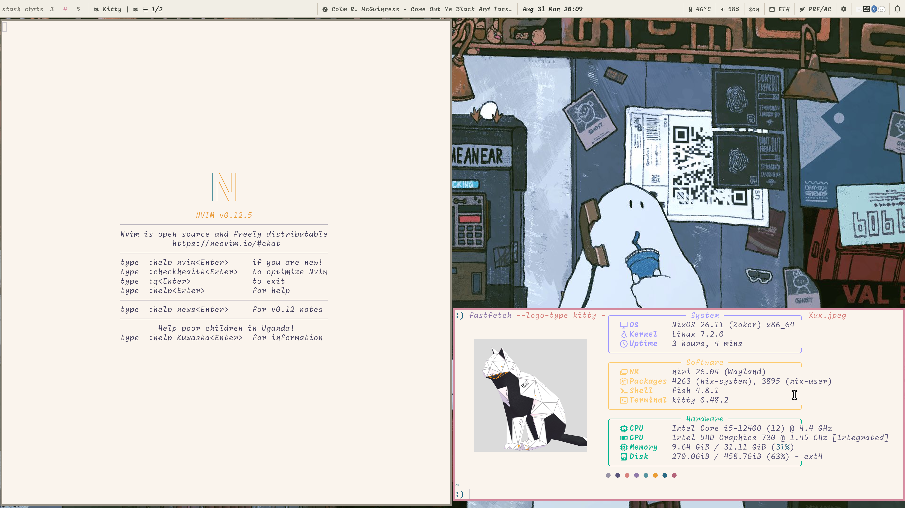

## Overview (Gallery)




[Rofi](https://github.com/davatorium/rofi)

App launcher

chiphist

command palette


view [Hyprland manual](./README/Hyprland.md), view [Uncoated Paper design manual](./README/PaperDesign.md)

## includes config

| Tool | |
| :---: | :---: |
| Terminal | ghostty, kitty |
| Editor | Neovim |
| Shell | zsh |
| Launcher | rofi |
| VCS | git |
| DE/WM | niri |
| Lock | Hypridle, Hyprlock |
| Bar | waybar |
| Wallpaper | awww(swww), mpvpaper |
| Filer | yazi |
| Scripts | Bash, Python |

Catppuccin, and rose-pine are used mainly themes of my tools.
and many of these scripts are dependent on my personal environment, it might not work as-is in your environment...

## Installation & Setup

This repository supports two main setup methods:

- **NixOS** (Full system + user management)
- **Standalone Home Manager** (User management on generic Linux distros like Debian/Ubuntu)

### 1. Standalone Home Manager (Generic Linux)

Use this if you are on Debian, Ubuntu, Arch, etc., and only want to use Nix for your user environment.

#### Step 1: Install Nix

Install Nix with the official installer:

```bash
sh <(curl -L https://nixos.org/nix/install) --daemon
```

#### Step 2: Enable Flakes

Ensure Flakes and Nix-command are enabled by adding this to `~/.config/nix/nix.conf` (or `/etc/nix/nix.conf`):

```text
experimental-features = nix-command flakes
```

#### Step 3: Clone & Deploy

```bash
git clone https://github.com/yourusername/dotfiles.git ~/dotfiles
cd ~/dotfiles
nix run home-manager/master -- init --flake .#seli
nix run home-manager/master -- switch --flake .#seli
```
Subsequent updates:

```bash
home-manager switch --flake .#seli
```

### 2. NixOS

There are two Linux hosts, each with its own hardware config:

| Host | Directory | Hostname | Notes |
| :---: | :--- | :---: | :--- |
| ThinkPad | `hosts/thinkpad/` | `selinoir` | AMD, fingerprint, lid/hibernate |
| Desktop | `hosts/desktop/` | `selipaq` | Intel, LUKS swap |

Machine-specific settings live in the host directory; shared desktop setup lives in `modules/desktop.nix`.

#### Initial Setup (per host)

Clone this repo to `~/dotfiles`, then generate and copy the hardware configuration:

```bash
sudo nixos-generate-config --dir /etc/nixos
sudo cp /etc/nixos/hardware-configuration.nix ~/dotfiles/hosts/thinkpad/
sudo cp /etc/nixos/hardware-configuration.nix ~/dotfiles/hosts/desktop/
# pick the directory matching the machine, then commit the new UUIDs
```

#### Apply Configuration

```bash
cd ~/dotfiles
sudo nixos-rebuild switch --flake .#thinkpad   # on the ThinkPad
sudo nixos-rebuild switch --flake .#desktop    # on the desktop
```

## Structure (simple)

```text
~/dotfiles
├── flake.nix
├── hosts/
│   ├── thinkpad/
│   │   ├── configuration.nix   # selinoir (AMD, fingerprint, lid/hibernate)
│   │   └── hardware-configuration.nix
│   ├── desktop/
│   │   ├── configuration.nix   # selipaq (Intel desktop)
│   │   └── hardware-configuration.nix
├── modules/
│   ├── common.nix
│   ├── desktop.nix
│   └── thinkpad.nix
├── home/
│   ├── seli.nix
│   ├── common_user.nix
│   └── ...
├── nvim/
├── kitty/
├── hypr/
├── waybar/
└── ...
```

- `hosts/<name>/configuration.nix`: per-machine settings (hostname, hardware-specific bits)
- `modules/desktop.nix`: system-wide desktop infrastructure shared by all NixOS hosts (Hyprland/niri, PipeWire, portal, polkit, etc.)
- `home/seli.nix`: personal apps and user config
- real app config files stay in this dotfiles repo as normal files/directories
- Home Manager deploys `~/.config/*` via `xdg.configFile` symlinks

## Maintenance & Updates

After making changes to your configuration files, use the following commands to apply them.

### Rebuild (Apply Changes)

**Standalone Linux (Debian, Ubuntu, etc.)**

```bash
cd ~/dotfiles
home-manager switch --flake .#seli
```

**NixOS**
```bash
cd ~/dotfiles
sudo nixos-rebuild switch --flake .#thinkpad   # on the ThinkPad
sudo nixos-rebuild switch --flake .#desktop    # on the desktop
```

### Update Packages (Flake Inputs)

To update the underlying packages (nixpkgs, etc.) to their latest versions:
```bash
cd ~/dotfiles
nix flake update
# Then run the appropriate rebuild command above
```
